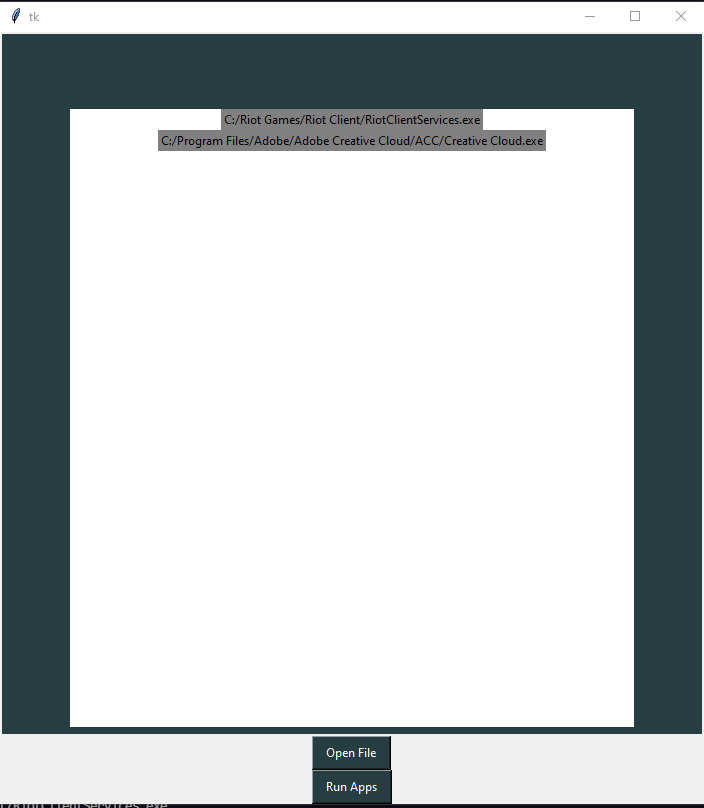

# fileRunner
A very simple program that allows you to open multiple programs at once. This was from a tutorial I followed by @Dev Ed so all credit to him. I did this just to get better with my python.

